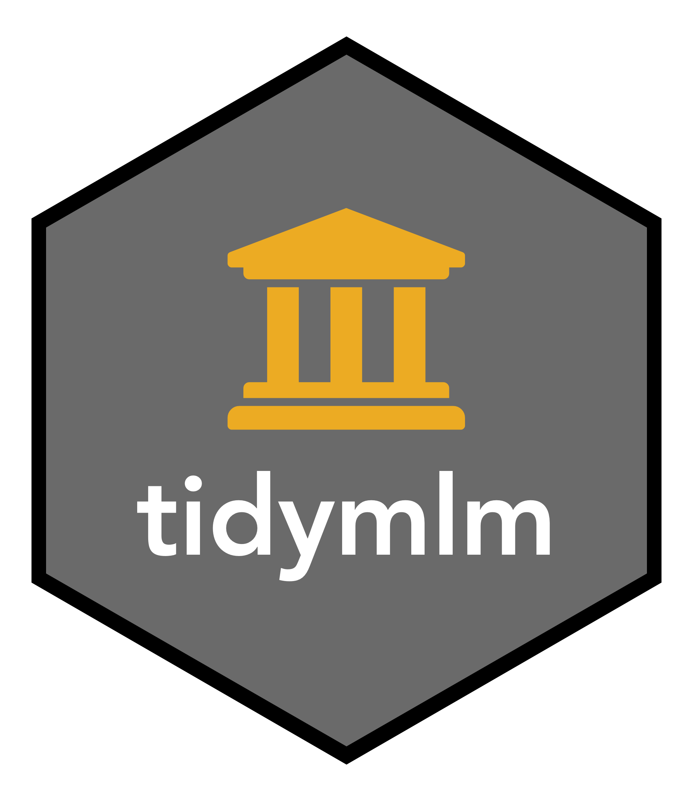

<!-- README.md is generated from README.Rmd. Please edit that file -->

```{r setup, include = FALSE}
knitr::opts_chunk$set(
  collapse = TRUE,
  comment = "#>",
  fig.path = "man/figures/README-",
  out.width = "100%",
  eval = TRUE
)
options(width = 100)
polcom <- tidyversity::polcom
```
# tidymlm  

[](https://www.tidyverse.org/lifecycle/#experimental)

🎓 Tidy tools for academics


## \*\*\* This package is in very early development. Feedback is encouraged!!! \*\*\*

## Installation

<!-- You can install the released version of tidymlm from [CRAN](https://CRAN.R-project.org) with:

``` r
install.packages("tidymlm")
```
-->

Install the development version from [Github](https://github.com/mkearney/tidymlm) with:

```{r install, eval=FALSE}
## install devtools if not already
if (!requireNamespace("devtools", quietly = TRUE)) {
  install.packages("devtools")
}
## install tidymlm from Github
devtools::install_github("mkearney/tidymlm")
```

Load the package (it, of course, plays nicely with tidyverse).

```{r library}
## load tidyverse
library(tidyverse)

## load tidymlm
library(tidymlm)
```

### Multilevel modeling (MLM)

Estimate multilevel (mixed effects) models.

```{r mlm}
lme4::sleepstudy %>%
  tidy_mlm(Reaction ~ Days + (Days | Subject)) %>%
  summary()
```

